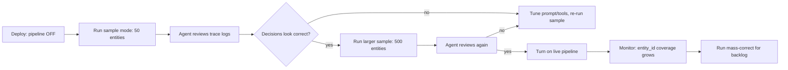
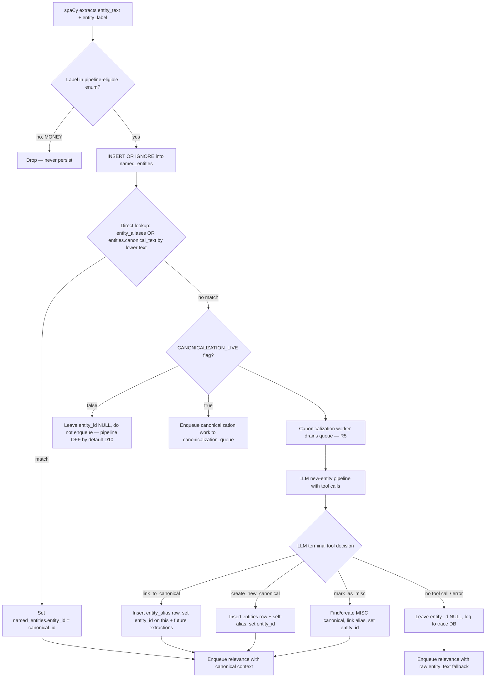
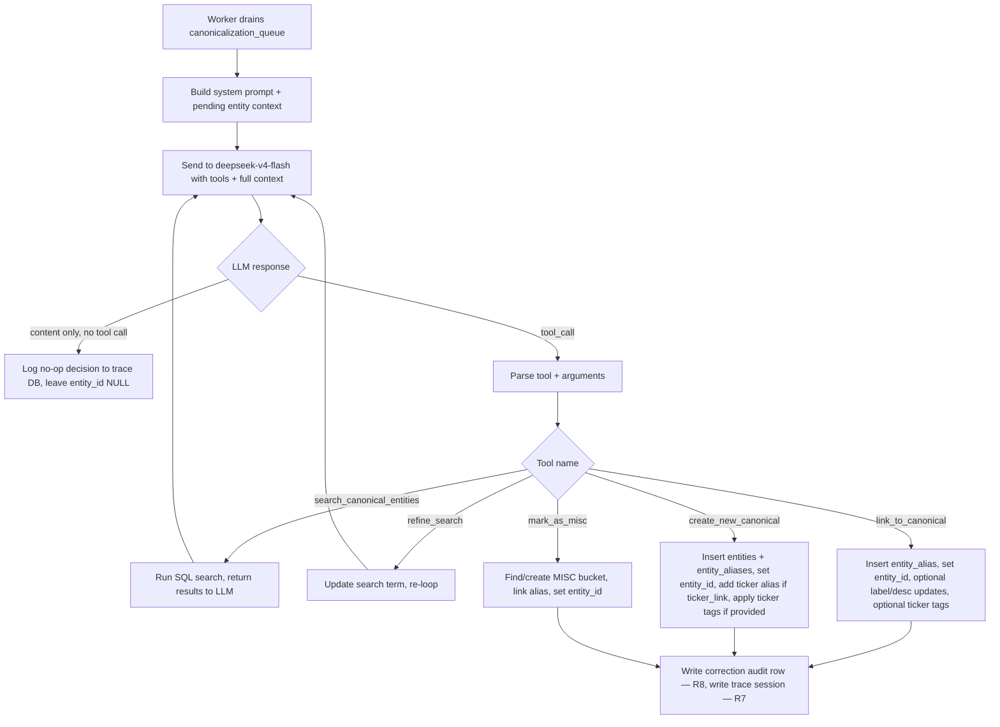
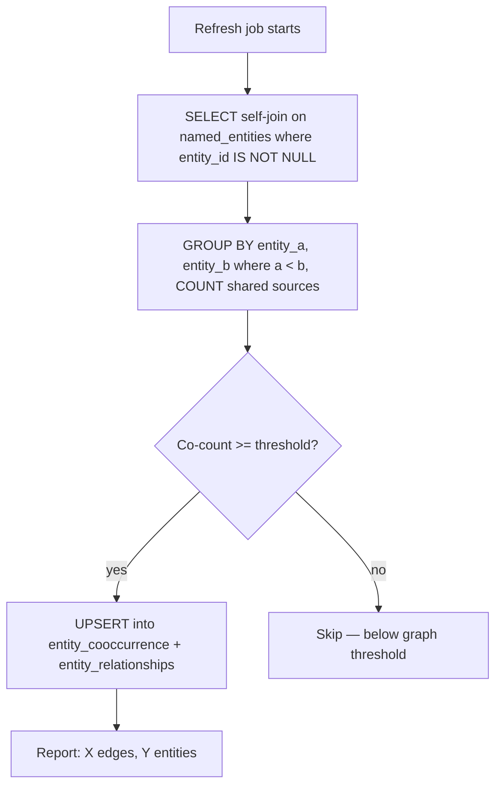
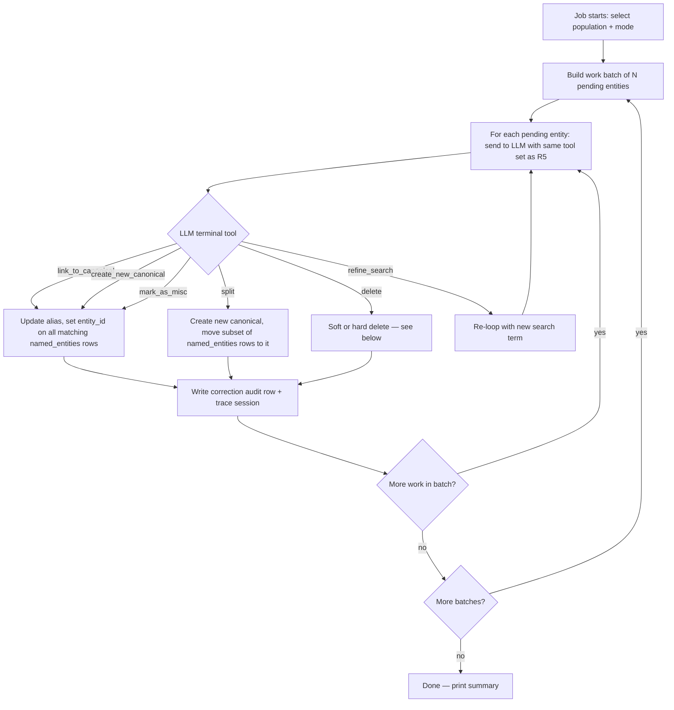

# 25 — Entity Canonicalization, Relationships & Graphing

**Phase**: 11 — Entity Resolution
**Dependencies**: 05, 06, 11, 21, 24 (entities API, NER processor, ticker fundamentals, relevance pipeline)
**Status**: not started

## Summary

Build the full entity resolution and relationship layer for FinanceSignal:

1. **Canonical entity registry** — a source-independent `entities` table populated by LLM tool calls, with an `entity_aliases` child table that absorbs every spaCy variant form so repeat extractions auto-link without LLM calls.
2. **Live canonicalization pipeline** — after NER extracts an entity, direct lookup against aliases; on hit, auto-link; on miss, enqueue LLM work via `deepseek/deepseek-v4-flash` (OpenRouter) with a multi-round tool-calling interface that can search, refine, link, create new canonicals, reclassify labels, and write dense descriptions.
3. **Manual mass-correction process** — a oneshot job that re-processes non-canonical and existing canonical entities with the same tool interface, plus split, cautious delete, and `MISC` bucketing.
4. **Standalone LLM trace database** — a separate `llm_trace.db` that records every prompt, tool definition, tool call, result, and error with **all context embedded verbatim** so it's a self-contained fine-tuning dataset with no cross-DB references.
5. **Corrections audit table** — rich before/after snapshots in `reddit_data.db` suitable as a LoRA training dataset.
6. **Entity relationship infrastructure** — schema for bidirectional RELATED-TO (Elon ↔ Tesla) and SAME-AS relationships, plus ticker ↔ company entity connection (via `ticker_link` + ticker-as-alias), and entity co-occurrence for graphing. Schema built and populated where cheap; full graph wiring and API/frontend noted as follow-up wiring within this story.

This story merges the former story 26 (ticker ↔ entity matching and entity graphing) into 25 because the relationship schema must be coherent with the canonical registry from the start.

## Motivation

The current `named_entities` table is a flat dump of raw spaCy extractions. The same real-world entity appears under dozens of variants with inconsistent labels:

- `Trump` (ORG, 14,386), `Trump` (PERSON, 1,672), `trump` (ORG, 126), `tRump` (ORG, 11), `TRUMP` (ORG, 100), `Trump &` (ORG, 22) — all the same person.
- `AMD` (Companies), `AMD` (Products) — same company, two labels.
- `$35K`, `10`, `100`, `1000`, `4.5M](https://techcrunch.com/2024/06/22` — junk, but junk that spaCy will repeat-extract.
- `0DTE` tagged `People`, `Anna` vs `ANNA` as separate rows — case and label noise.

Without canonicalization, counts aggregate wrong, the Entities page shows 20 rows for "Trump," and the relevance ranking from Story 24 scores `Trump` (ORG) and `Trump` (PERSON) as unrelated entities.

The two `is_canonical` / `canonical_link` columns previously added to `named_entities` are **the wrong home** — see Design Decisions D1.

## Design Decisions (resolved from initial flags)

### D1 — `is_canonical` / `canonical_link` on `named_entities` is the wrong home

`named_entities` is really **`entity_mentions`** — one row per `(source, entity_text, entity_label)` extraction. A canonical entity ("Donald Trump", the concept) is source-independent; it makes no sense to crown one specific per-source extraction row as "the canonical" and have all other extractions point at it. That ties a canonical entity to wherever it was first extracted, breaks when that source is deleted, and forces a self-join on a 100M+ row table for every entity query.

**Resolution:** Introduce a separate **`entities`** table (the canonical registry, ~thousands of rows). Each `named_entities` row gains an `entity_id` FK pointing to its canonical `entities` row. The `is_canonical` / `canonical_link` columns are left in place for back-compat but unused; new code uses `entity_id`.

### D2 — Aliases as a child table (option b)

An **`entity_aliases`** child table — one row per `(canonical_id, alias_text, alias_label)`. Queryable, indexable, lets a single alias text resolve to different canonicals by label context if needed.

**Key behavior:** when a seen entity — however spaCy parses it — is processed, it auto-links via the alias lookup. The alias table absorbs spaCy's variant outputs so repeat extractions of the same string never trigger LLM calls. This is the catch mechanism: once an alias exists, every future extraction of that text bypasses the LLM entirely.

The lookup is case-insensitive on `alias_text`, with a unique index on `lower(alias_text)` for the hot path.

### D3 — Label is a pipeline entry gate, not a match filter

spaCy's `entity_label` is unreliable for matching (`Trump` appears as ORG/PERSON/WORK_OF_ART/LAW) but useful as a **gate** for what enters the pipeline at all.

**Entity type enum — pipeline-eligible labels:**

| spaCy label | Enters pipeline? | Canonical label | Rationale |
|---|---|---|---|
| `PERSON` | Yes | `PERSON` | People — key signal |
| `ORG` | Yes | `ORG` | Companies, agencies, organizations |
| `GPE` | Yes | `GPE` | Geopolitical entities (countries, cities) |
| `PRODUCT` | Yes | `PRODUCT` | Products (iPhone, ChatGPT, Blackwell) |
| `EVENT` | Yes | `EVENT` | Events (earnings, CPI, Olympics) |
| `NORP` | Yes | `NORP` | Nationalities/groups (Republicans, Democrats) |
| `FAC` | Yes | `FAC` | Facilities (rare but valid) |
| `WORK_OF_ART` | Yes | `WORK_OF_ART` | Works (rare but valid) |
| `LAW` | Yes | `LAW` | Laws (rare but valid) |
| `MONEY` | **No — excluded entirely** | — | Pure noise. `$35K`, `10`, `100`, `4.5M](https://...` — never persisted to `named_entities`. Filtered at NER extraction time by removing `MONEY` from `USEFUL_LABELS`. |
| (new) | Yes | `MISC` | For junk that spaCy repeat-extracts but isn't a real entity. Bucketed so future extractions auto-link without LLM calls. |

**MONEY is excluded from the DB entirely** — filtered at the NER processor level before any insert. This is a change to `USEFUL_LABELS` in `app/ner_processor.py`: remove `"MONEY"` from the set.

### D4 — MISC as a catch, not a drop

Even if something is not a real entity, if spaCy mis-identifies it once it is likely to do it again. Junk strings (e.g. `0DTE`, `AfterHour`, `4.5M](https://...`) get canonicalized into `MISC` buckets so that **future extractions of the same string auto-link via the alias table without triggering LLM calls**. This is the catch mechanism — it reduces LM cost over time as the MISC buckets absorb known junk.

MISC canonicals may be:
- **Generic buckets** — e.g. "URL Artifacts", "Markdown Remnants", "Ticker-like Tokens" — one canonical per junk category, multiple aliases absorbed.
- **Specific junk** — if a junk string is common enough (e.g. `0DTE` with 606 occurrences), it gets its own MISC canonical row so its description can explain what it actually is (a options-trading acronym, not a person).

The LLM's `mark_as_misc` tool decides whether to use an existing MISC bucket or create a new one.

**Money is still excluded entirely (D3)** — it's so pervasive and so uniformly junk that bucketing it would create one massive useless canonical. Better to filter at the source.

### D5 — `llm_trace.db` is fully standalone

The trace database must be a self-contained dataset. Every session record includes:
- The **goal/purpose** of the prompt (what task the LLM was performing).
- The **full system prompt** verbatim.
- The **full tool definitions** verbatim.
- The **full user message** verbatim — including any posts, entity descriptions, search results, or other context that was fed in. If the prompt references a post body that lives in `reddit_data.db`, the post body is **copied into the trace** — not referenced by ID.
- Every **assistant response** (content + tool calls).
- Every **tool result** returned to the LLM.
- Every **error** with full payloads.

This means the trace DB has duplicated text (post bodies appear both in `reddit_data.db` and in `llm_trace.db`). This is intentional — the trace DB is for **unrelated LLM tool-call training** and must not require cross-DB references to reconstruct what the LLM saw. Storage optimization is explicitly not a priority here; completeness is.

The existing `llm_analyses` table in `reddit_data.db` stays for thin summary access and backward compat. Its `analysis_id` is stored as `external_ref` in the trace DB for joinability, but the trace DB does not *depend* on it — all context is self-contained.

### D6 — Ticker ↔ Company Entity Connection

Tickers (`ticker_mentions`, `ticker_fundamentals`) and canonical entities (`entities`) are separate concepts that need a bridge. The connection has two layers:

**Layer 1 — Structured 1-1 link (`entities.ticker_link`):**
```sql
entities.ticker_link TEXT  -- e.g. "TSLA" for the Tesla company entity
```
- Set by the LLM during `create_new_canonical` or `link_to_canonical` when the entity is a company with a known ticker.
- The authoritative company→ticker connection. One ticker per entity (a company has one primary ticker).
- For companies with multiple tickers (rare — dual-listed), use `entity_ticker_links` (R6).

**Layer 2 — Ticker symbol as alias (the catch):**
When a company entity is created with `ticker_link="TSLA"`, the ticker symbol "TSLA" is **also added as an alias** of that entity. This means:
- spaCy extracts "TSLA" as an ORG → direct lookup hits the alias → auto-links to the Tesla entity. No LLM call.
- regex ticker extraction finds $TSLA → that's a separate `ticker_mentions` row (different system), but the entity layer now has "TSLA" → Tesla entity too.

**The flow:**
```
spaCy extracts "Tesla" (ORG)  ─┐
                              ├→ LLM creates canonical "Tesla" (ORG, ticker_link="TSLA")
spaCy extracts "TSLA" (ORG)  ─┘   + adds aliases: "Tesla", "TSLA"
                                    ↓
Future: spaCy extracts "TSLA" → alias lookup hits → auto-link to Tesla entity (no LLM)
Future: spaCy extracts "Tesla" → alias lookup hits → auto-link (no LLM)
```

**What about existing ticker entities?** If "TSLA" was already created as a separate canonical entity (ORG) before "Tesla" was canonicalized, the LLM should use `link_to_canonical` to merge "TSLA" as an alias of "Tesla" (or vice versa), and set `ticker_link` on the surviving canonical. The mass-correct process (R8) handles this.

**Why not just use `ticker_mentions`?** Ticker mentions are regex-extracted and live in a separate system. The entity layer is NER-extracted and semantically richer (has descriptions, relationships). The `ticker_link` column bridges them: from an entity, you get its ticker; from a ticker page, you query `entities WHERE ticker_link=?` to get the company entity and its relationships.

### D7 — Entity Relationship Infrastructure (built, not fully wired)

Two relationship types, stored in a single `entity_relationships` table:

| Type | Meaning | Direction | Example |
|---|---|---|---|
| `related_to` | Two entities are associated in the real world | Bidirectional (symmetric) | Elon Musk ↔ Tesla, Tesla ↔ TSLA (ticker), Jensen Huang ↔ NVIDIA |
| `same_as` | Two entity rows represent the identical real-world thing but are kept as separate rows for a structural reason | Bidirectional | "Apple Inc." entity SAME-AS "Apple" entity (if both exist before merge) |

**Why `same_as` is separate from alias-merging:** Aliases absorb variant text forms ("Trump" → "Donald Trump"). `same_as` is for when two *distinct canonical entities* were created independently and later discovered to be the same — a softer merge that preserves both rows for audit but links them. The mass-correct process can promote `same_as` to a full merge (absorb one into the other's aliases) when confirmed.

**Schema is built in this story.** Population is via:
- **LLM tool calls** — the canonicalization tools can optionally set relationships (e.g. "create Jensen Huang as PERSON, related_to NVIDIA"). Not wired in the initial tools — flagged as a follow-up.
- **Co-occurrence** — the `entity_cooccurrence` table (computed from shared sources) is the data-driven relationship graph. Built and populated by a refresh job in this story.
- **Manual** — the mass-correct process can set relationships explicitly.

Full graph API and frontend are noted as wiring steps in this story but may be stubbed for a follow-up PR.

### D8 — Co-occurrence as the graph backbone

Entity co-occurrence (two canonical entities appearing in the same post/comment) is the cheapest, most data-driven relationship. It's computed from `named_entities` self-joined on `(source_type, source_id)` where both rows have non-null `entity_id` and different `entity_id`.

- Materialized in an `entity_cooccurrence` table, refreshed by a periodic job.
- The primary input to the entity graph (Story 26's core feature, now merged here).
- Not incrementally maintained — recomputed from raw data on each refresh (too expensive per-insert).

### D9 — Ticker Tag Assignment via LLM

The existing ticker tag system (now DB-backed via `ticker_tag_sets` + `ticker_tag_members` tables, managed via `/api/ticker-tags` CRUD) has tag sets like `ambiguous`, `crypto`, `etf` — each is a `{id, name, color, description}` record with associated tickers. These tags mark tickers that need special handling: `AI` is a common-word ticker (ambiguous), `BTC` is crypto, `SPY` is an ETF.

When the canonicalization LLM processes an entity with a `ticker_link`, it should be able to assign ticker tags directly. This catches problematic tickers at the entity layer before they pollute downstream — e.g. spaCy extracts "AI" as an ORG, the LLM recognizes it as the ambiguous ticker `AI` (not a company), creates the canonical with `ticker_link="AI"` and tags it `ambiguous`. The next time "AI" is extracted, the alias lookup catches it and the tag is already in place.

**How it works:**
- The `create_new_canonical` and `link_to_canonical` tools gain an optional `ticker_tags` argument — an array of tag set IDs (e.g. `["ambiguous", "crypto"]`).
- The tool execution handler writes to the `ticker_tag_members` table via the existing DB methods (`db.add_tickers_to_tag`, `db.remove_ticker_from_tag`).
- The LLM is given the list of available tag sets (with descriptions) in its system prompt so it knows what's available.
- The `search_canonical_entities` tool result includes each matched entity's current ticker tags, so the LLM can see existing tags before deciding to add more.

**Tag sets the LLM should know about (existing, in DB):**

| Tag ID | Purpose | Example tickers |
|---|---|---|
| `ambiguous` | Common-word tickers that are frequently misidentified | `AI`, `AND`, `ATM`, `RS`, `BIG` |
| `crypto` | Cryptocurrency tickers | `BTC`, `ETH`, `DOGE`, `XRP` |
| `etf` | Exchange-traded funds | `SPY`, `QQQ`, `VTI`, `ARKK` |

The LLM can assign any combination. If a ticker is both crypto and ambiguous (e.g. `AND` — could be a logic keyword or a crypto ticker), both tags apply.

**Guard:** the LLM can only assign tags to **existing** tag sets — it cannot create new ones via tool call (that's a manual admin action via the existing CRUD API). If the LLM references a tag set ID that doesn't exist, the tool returns an error listing the valid IDs.

### D10 — Live Pipeline OFF by Default; Sample Mode for Safe Rollout

The live canonicalization pipeline (R4 → R5) is **disabled by default** on initial deployment. Entities extracted by NER are persisted to `named_entities` as before, but misses do **not** enqueue canonicalization work. `entity_id` stays NULL for all new extractions until the pipeline is explicitly turned on.

This is a deliberate rollout safety measure: we don't want to hammer the OpenRouter API with thousands of LLM calls on day one, producing junk before we've validated the system prompt, tool design, and LLM decision quality.

**The rollout path:**



**Sample mode (part of the mass-correct process, R9):**
- `entity_mass_correct --sample 50` — processes the next 50 unlabeled entities (by descending occurrence count) and writes full trace sessions + correction audit rows, but does **not** apply the corrections to `reddit_data.db`. This is an extension of the existing `--dry-run` flag: `--sample N` implies `--dry-run` but also limits the work to N entities and selects the highest-impact ones first.
- The LLM sees the same tools, same system prompt, same multi-round loop. The only difference: terminal tool calls are logged to `entity_corrections` with `after_state=null` and `initiated_by='sample'` — they are not executed.
- This produces a reviewable batch of "what the LLM would do" for the 50 most common unlabeled entities.

**Agent-queryable review logs:**
The trace DB and correction audit are structured so an opencode agent can programmatically review a sample run:

```sql
-- Get all sample-run sessions
SELECT s.id, s.status, s.round_count, s.total_input_tokens, s.total_output_tokens
FROM llm_trace.sessions s
WHERE s.purpose = 'mass_correct' AND s.status = 'completed'
ORDER BY s.created_at DESC;

-- Get the terminal tool decision for each
SELECT c.id, c.action, c.pending_text, c.pending_label,
       c.target_canonical_id, c.llm_tool_used, c.reasoning
FROM entity_corrections c
WHERE c.initiated_by = 'sample'
ORDER BY c.created_at DESC;

-- Get the full conversation for a specific session
SELECT round, role, content, tool_calls, tool_name
FROM llm_trace.messages
WHERE session_id = ?
ORDER BY round, id;

-- Get tool outcomes (what the LLM called, what we returned)
SELECT tool_name, arguments, result, is_error
FROM llm_trace.tool_outcomes
WHERE session_id = ?;

-- Check for errors
SELECT stage, error_code, message
FROM llm_trace.errors
WHERE session_id = ?;
```

The agent checks:
1. **No errors** — every session completed without `errors` rows.
2. **Sensible actions** — `action` distribution looks right (mostly `link_alias` for common entities, some `create_new_canonical`, some `mark_as_misc` for junk).
3. **Reasonable labels** — the LLM isn't mass-relabeling everything to one label.
4. **Descriptions are dense** — `create_new_canonical` calls have non-trivial descriptions (not one-word, not empty, not filler).
5. **Tag assignments make sense** — ambiguous/crypto/etf tags are assigned to the right tickers.
6. **No hallucinated canonicals** — `target_canonical_id` references exist and are plausible matches.
7. **Token cost** — `total_input_tokens + total_output_tokens` per session is within expected bounds.

The agent writes its review verdict (pass/fail per session, with notes) to a review file or back to the trace DB. Once the agent confirms the sample looks correct, the user flips the config flag to turn on the live pipeline.

**Config flag:**
```python
# In sentinel/config.py or app/config.py
CANONICALIZATION_LIVE = os.environ.get("CANONICALIZATION_LIVE", "false").lower() in ("1", "true", "yes")
```
- `false` (default) — live pipeline is off. NER extractions with alias misses are left `entity_id=NULL`. No LLM calls.
- `true` — live pipeline is on. Alias misses enqueue to `canonicalization_queue`, worker drains and calls the LLM.

The `canonicalization_worker` ProcessManager job checks this flag on startup: if `false`, it starts, sees the flag is off, and exits with a log message "Canonicalization live pipeline disabled — set CANONICALIZATION_LIVE=true to enable."

---

## Requirements

### R1 — Canonical Entity Registry (`entities` table)

New table in `reddit_data.db`:

```sql
CREATE TABLE IF NOT EXISTS entities (
    id              INTEGER PRIMARY KEY AUTOINCREMENT,
    canonical_text  TEXT NOT NULL,                  -- display form: "Donald Trump", "NVIDIA", "Tesla, Inc."
    canonical_label TEXT NOT NULL,                  -- authoritative label: PERSON, ORG, MISC, GPE, ...
    description     TEXT,                           -- 2–4 sentence dense summary (for vector embed + context)
    ticker_link     TEXT,                            -- primary 1-1 ticker symbol (e.g. "TSLA") — see D6
    status          TEXT NOT NULL DEFAULT 'active',  -- active | merged | deleted
    merged_into     INTEGER,                         -- FK entities.id if status='merged'
    created_at      REAL NOT NULL,
    updated_at      REAL NOT NULL,
    source          TEXT NOT NULL DEFAULT 'llm',     -- llm | manual | seed
    UNIQUE(canonical_text, canonical_label)
);
CREATE INDEX IF NOT EXISTS idx_entities_label ON entities(canonical_label);
CREATE INDEX IF NOT EXISTS idx_entities_ticker ON entities(ticker_link);
CREATE INDEX IF NOT EXISTS idx_entities_status ON entities(status);
```

- `status='merged'` — entity absorbed into another; queries filter `status='active'`. Kept for audit.
- `status='deleted'` — cautious-delete case (R8). Row retained, never physically removed, so corrections audit stays intact.
- `source='seed'` — hand-seeded canonicals (R9).
- `canonical_label` uses the pipeline-eligible enum from D3, plus `MISC`.

### R2 — Alias Table (`entity_aliases`)

```sql
CREATE TABLE IF NOT EXISTS entity_aliases (
    id              INTEGER PRIMARY KEY AUTOINCREMENT,
    canonical_id    INTEGER NOT NULL REFERENCES entities(id),
    alias_text      TEXT NOT NULL,                  -- variant form: "Trump", "trump", "tRump", "TSLA"
    alias_label     TEXT,                           -- spaCy label as extracted (nullable — label-free match allowed)
    created_at      REAL NOT NULL,
    UNIQUE(canonical_id, alias_text, alias_label)
);
CREATE INDEX IF NOT EXISTS idx_ea_canonical ON entity_aliases(canonical_id);
CREATE INDEX IF NOT EXISTS idx_ea_alias_lower ON entity_aliases(lower(alias_text));
```

- **The direct-lookup path** queries `entity_aliases` on `lower(alias_text) = lower(?)`. O(1) via `idx_ea_alias_lower`.
- An alias may exist under multiple labels (`Trump` ORG, `Trump` PERSON both → Donald Trump). `alias_label` is stored for context but not filtered on in the lookup.
- `entities.canonical_text` is implicitly an alias — the lookup also checks `lower(entities.canonical_text)` in one query (UNION or a view).
- **Ticker symbols as aliases** (D6): when a company entity is created with `ticker_link="TSLA"`, "TSLA" is inserted as an alias too. This is the catch for future spaCy extractions of the ticker symbol.

### R3 — Link `named_entities` to the Canonical Registry

```sql
ALTER TABLE named_entities ADD COLUMN entity_id INTEGER REFERENCES entities(id);
CREATE INDEX IF NOT EXISTS idx_ne_entity_id ON named_entities(entity_id);
```

- Every existing and future `named_entities` row gets an `entity_id` (nullable during migration; populated by the live pipeline R4 and the backfill).
- The live NER pipeline (R4) sets `entity_id` at extraction time via the direct-lookup path.
- The Entities API `/top` and `/search` endpoints group by `entity_id` (resolving to `entities.canonical_text` / `canonical_label`) when set; falls back to raw `entity_text` for unlinked rows (back-compat).

### R4 — Live Canonicalization Hook in the NER Pipeline

**Step 1 — MONEY exclusion (D3):** Remove `"MONEY"` from `USEFUL_LABELS` in `app/ner_processor.py`. MONEY-labeled extractions are never persisted. Existing MONEY rows in `named_entities` are cleaned up by the mass-correct process (R8) or a one-time `DELETE FROM named_entities WHERE entity_label='MONEY'` migration.

**Step 2 — Canonicalization hook:** Insert into `app/ner_processor.py`, after `save_named_entities` and before relevance enqueueing:



- **Direct lookup** — single query against `entity_aliases` + `entities` on `lower(text)`. O(1) via the `idx_ea_alias_lower` index. Case-insensitive. **This is the catch**: once an alias exists, every future extraction of that string bypasses the LLM entirely.
- **Canonicalization queue** — new `canonicalization_queue` table (same pattern as `ner_queue` / `relevance_queue`) for misses. Drained by a worker process (R5).
- **Failure isolation** — the LLM step is async and fallible; the live pipeline never blocks on it. `entity_id` stays NULL until the worker resolves it. Relevance still enqueues with the raw `entity_text` as the query string (degraded but functional).
- **Deduplication at enqueue** — if the same `(entity_text, entity_label)` is extracted from many sources in the same window, only enqueue canonicalization work once per unique pair. The `canonicalization_queue` has `UNIQUE(entity_text, entity_label)` for pending work.

### R5 — LLM New-Entity Pipeline (the tool-calling core)

New module: `app/canonicalization_worker.py` + `src/sentinel/canonicalize.py`.

**Model:** `deepseek/deepseek-v4-flash` (already in `AVAILABLE_MODELS`, `supports_tools: True`) — cheap, fast, tool-capable. Invoked via the shared OpenRouter integration (R10).

**Tool set (offered to the LLM):**

| Tool | Purpose |
|------|---------|
| `search_canonical_entities` | Search the `entities` + `entity_aliases` tables by text fragment (case-insensitive, **label-agnostic** — D3). Returns top N matches with `id`, `canonical_text`, `canonical_label`, `description`, `ticker_link`, ticker tags, alias count, occurrence count. |
| `refine_search` | Replace the pending entity's search term with a refined one (better capitalization, expanded name) and re-run search. Allows back-and-forth before deciding. |
| `link_to_canonical` | Mark the pending entity as an alias of an existing `entities.id`. Args: `canonical_id`, optional `rename_alias` (better capitalization of the alias text), optional `update_label` (reclassify the canonical's label), optional `append_description`, optional `ticker_tags` (D9). |
| `create_new_canonical` | Create a new `entities` row with `canonical_text`, `canonical_label`, `description` (required, dense), optional `ticker_link`, optional `ticker_tags` (D9). The pending entity becomes its first alias. If `ticker_link` is set, the ticker symbol is also added as an alias (D6). |
| `mark_as_misc` | Link to an existing MISC canonical or create a new one. Args: `misc_bucket_id` (optional — if known), or `new_bucket_name` + `description`. Used for junk that spaCy repeat-extracts (D4). |



**Multi-round behavior.** The LLM may call `search_canonical_entities` or `refine_search` multiple times before issuing a terminal tool (`link_to_canonical` / `create_new_canonical` / `mark_as_misc`). The worker loops up to `MAX_CANON_ROUNDS = 6`. Each round's tool call, arguments, and result is appended to the conversation and logged verbatim to the trace DB.

**The LLM sets all metadata.** `link_to_canonical` and `create_new_canonical` accept `canonical_label` so the LLM can reclassify (fix `Trump` ORG → PERSON, fix `AMD` Products → ORG). The search tool does not filter by label (D3). `create_new_canonical` requires a `description` — the system prompt enforces density (2–4 sentences covering what the entity is, its domain, key identifiers, disambiguating context) so descriptions are usable for vector similarity in the graph layer.

**Scope discipline.** The live pipeline invokes the LLM for **one pending entity at a time**. No batch canonicalization, no "fix the whole cluster" in the live path — that's R9. Explicit scope-creep avoidance.

### R6 — Entity Relationship Tables (schema built, not fully wired)

```sql
CREATE TABLE IF NOT EXISTS entity_relationships (
    entity_a       INTEGER NOT NULL REFERENCES entities(id),
    entity_b       INTEGER NOT NULL REFERENCES entities(id),
    relationship   TEXT NOT NULL,      -- 'related_to' | 'same_as'
    weight         REAL,              -- confidence (0–1) or co-occurrence count
    bidirectional  INTEGER DEFAULT 1,  -- 1 = symmetric (A→B implies B→A)
    source         TEXT NOT NULL,     -- 'llm' | 'cooccurrence' | 'manual' | 'seed'
    llm_session_id INTEGER,           -- FK to llm_trace.db sessions.id (cross-DB ref, stored as int)
    created_at     REAL NOT NULL,
    PRIMARY KEY (entity_a, entity_b, relationship)
);
CREATE INDEX IF NOT EXISTS idx_er_entity_a ON entity_relationships(entity_a);
CREATE INDEX IF NOT EXISTS idx_er_entity_b ON entity_relationships(entity_b);
```

- `entity_a < entity_b` enforced by ID ordering to avoid duplicate symmetric edges.
- `source='cooccurrence'` rows are written by the co-occurrence refresh job (R7).
- `source='llm'` rows will be written when the LLM tools gain relationship-setting capability (follow-up wiring — schema supports it now).
- `source='seed'` for hand-seeded relationships (R10).

### R7 — Entity Co-occurrence (graph backbone)

```sql
CREATE TABLE IF NOT EXISTS entity_cooccurrence (
    entity_a   INTEGER NOT NULL REFERENCES entities(id),
    entity_b   INTEGER NOT NULL REFERENCES entities(id),
    co_count   INTEGER NOT NULL,     -- number of shared sources
    last_seen  REAL,
    PRIMARY KEY (entity_a, entity_b)
);
```

- Populated by a ProcessManager job `entity_graph_refresh` (oneshot, manual or scheduled daily).
- Computed from `named_entities` self-joined on `(source_type, source_id)` where both rows have non-null `entity_id` and different `entity_id`.
- `entity_a < entity_b` enforced by ID ordering.
- Also writes `source='cooccurrence'` rows to `entity_relationships` with `weight=co_count` — so the graph query can use either table.
- Self-edges (entity_a = entity_b after a canonical merge) are filtered out.



### R8 — Corrections Audit Table (`entity_corrections`)

```sql
CREATE TABLE IF NOT EXISTS entity_corrections (
    id                  INTEGER PRIMARY KEY AUTOINCREMENT,
    action              TEXT NOT NULL,         -- 'link_alias' | 'create_canonical' | 'mark_misc' | 'rename' | 'relabel' | 'update_description' | 'split' | 'delete' | 'merge_canonical' | 'set_ticker_link' | 'set_relationship'
    pending_text        TEXT,                  -- the raw extracted text that triggered the correction
    pending_label       TEXT,
    source_entity_id    INTEGER,              -- named_entities.id of the extraction being corrected
    target_canonical_id INTEGER,              -- entities.id affected (created / linked / merged into)
    new_canonical_id    INTEGER,              -- for 'merge_canonical' / 'split' — the new canonical
    before_state         TEXT,                -- JSON snapshot of affected rows before the change
    after_state          TEXT,                -- JSON snapshot after
    llm_session_id       INTEGER,             -- FK to llm_trace.db sessions.id (cross-DB ref, stored as int)
    llm_tool_used        TEXT,                -- which terminal tool the LLM picked
    reasoning            TEXT,                -- LLM's content response / rationale if any
    initiated_by         TEXT NOT NULL,       -- 'pipeline' | 'manual_mass_correct' | 'manual_ui'
    created_at           REAL NOT NULL
);
CREATE INDEX IF NOT EXISTS idx_ec_target ON entity_corrections(target_canonical_id);
CREATE INDEX IF NOT EXISTS idx_ec_action ON entity_corrections(action);
CREATE INDEX IF NOT EXISTS idx_ec_session ON entity_corrections(llm_session_id);
```

- `before_state` / `after_state` are JSON snapshots of the `entities` + `entity_aliases` + `named_entities.entity_id` rows touched. This is the replay mechanism.
- One correction row per terminal tool call (not per search round — search rounds are in the trace DB).
- This table is the **labelled dataset for LoRA**: input = `(pending_text, pending_label, search_results)`, output = `(action, target, new_text, new_label, description)`, reasoning = LLM rationale.

### R9 — Manual Mass-Correction Oneshot Process

New ProcessManager job: `entity_mass_correct` (oneshot, manual, `auto_start: false`).

Operates over two populations, user-selectable:
- **Non-canonical** — `named_entities` rows with `entity_id IS NULL`, grouped by `(entity_text, entity_label)` by descending occurrence count.
- **Already-canonical** — `entities` rows with `status='active'`, re-presented to the LLM for re-validation (catches bad early decisions).



**Beyond the live pipeline (R5), this process adds:**

- **Split.** `split` tool: given a canonical entity that has absorbed two distinct real-world entities, create a new canonical and migrate a selected subset of `named_entities` rows (by `source_id` list or by subreddit / time window) to the new canonical. Cautious — requires an explicit `subset_criteria` argument.
- **Cautious delete.** `delete` tool: for pure-junk `named_entities` (the `$35K`, `4.5M](https://...` rows, or MONEY rows that slipped through before the filter). Two modes:
  - **Soft** — set the canonical `entities.status='deleted'` and null out `named_entities.entity_id` for affected rows. Rows stay in `named_entities` for audit.
  - **Hard** — `DELETE FROM named_entities WHERE entity_text=? AND entity_label=?` after writing a `before_state` snapshot to `entity_corrections`. Only available in mass-correct, never in the live pipeline. Requires `confirm: true` arg. The correction audit row is the recovery path.
- **Re-search with refined terms.** Same `refine_search` / `search_canonical_entities` back-and-forth as R5.
- **Batch size** — N entities per batch (default 25), each its own LLM session. Resumable via a `last_processed` watermark in `processes.json` state.
- **Dry-run mode** — `--dry-run` flag: run the LLM and log decisions to `entity_corrections` with `after_state=null`, apply nothing. A follow-up `--apply` run executes the recorded decisions.

### R10 — Standalone LLM Trace Database (`llm_trace.db`)

New file at `DATA_DIR / "llm_trace.db"`. **Separate from `reddit_data.db`** — different concern (fine-tuning dataset), different growth rate. **All context is embedded verbatim** (D5) — the trace DB is self-contained.

```sql
-- One row per LLM interaction session (canonicalization, ticker analysis, mass-correct, future uses)
CREATE TABLE sessions (
    id                INTEGER PRIMARY KEY AUTOINCREMENT,
    purpose           TEXT NOT NULL,          -- 'canonicalization' | 'mass_correct' | 'ticker_analysis' | 'event_watcher' | ...
    model             TEXT NOT NULL,          -- 'deepseek/deepseek-v4-flash', etc.
    goal              TEXT NOT NULL,          -- human-readable description of what this session was trying to accomplish
    external_ref      TEXT,                   -- e.g. analysis_id in reddit_data.db (optional, for joinability — not required for trace completeness)
    status            TEXT NOT NULL,          -- 'completed' | 'error' | 'truncated' | 'no_tool_call'
    system_prompt     TEXT NOT NULL,          -- full verbatim system prompt
    tool_definitions  TEXT NOT NULL,          -- full JSON array of tool defs offered
    input_context     TEXT NOT NULL,          -- JSON: ALL data fed to the LLM — pending entity text, search results, post bodies (verbatim), entity descriptions, everything. Self-contained.
    created_at        REAL NOT NULL,
    completed_at      REAL,
    total_input_tokens  INTEGER,
    total_output_tokens  INTEGER,
    round_count       INTEGER DEFAULT 0
);

CREATE TABLE messages (
    id              INTEGER PRIMARY KEY AUTOINCREMENT,
    session_id      INTEGER NOT NULL REFERENCES sessions(id),
    round           INTEGER NOT NULL,         -- 0-based tool round
    role            TEXT NOT NULL,            -- 'system' | 'user' | 'assistant' | 'tool'
    content         TEXT,                     -- text content (null if pure tool call). For 'user' role: full verbatim text including all referenced data.
    tool_calls      TEXT,                     -- JSON array of tool_call objects (assistant role)
    tool_call_id    TEXT,                     -- set when role='tool' (result of a specific call)
    tool_name       TEXT,                     -- set when role='tool'
    is_error        INTEGER DEFAULT 0,        -- set when role='tool' and result is an error
    created_at      REAL NOT NULL
);
CREATE INDEX idx_messages_session ON messages(session_id, round);

CREATE TABLE tool_outcomes (
    id              INTEGER PRIMARY KEY AUTOINCREMENT,
    session_id      INTEGER NOT NULL REFERENCES sessions(id),
    tool_call_id    TEXT NOT NULL,
    tool_name       TEXT NOT NULL,
    arguments       TEXT NOT NULL,           -- JSON of the args the LLM passed
    result          TEXT NOT NULL,           -- JSON of what we returned to the LLM (verbatim, includes all search result data)
    db_effect       TEXT,                    -- JSON summary of rows changed in reddit_data.db (for auditability)
    is_error        INTEGER DEFAULT 0,
    created_at      REAL NOT NULL
);
CREATE INDEX idx_outcomes_session ON tool_outcomes(session_id);
CREATE INDEX idx_outcomes_tool ON tool_outcomes(tool_name);

CREATE TABLE errors (
    id              INTEGER PRIMARY KEY AUTOINCREMENT,
    session_id      INTEGER REFERENCES sessions(id),
    round           INTEGER,
    stage           TEXT NOT NULL,           -- 'request' | 'stream' | 'tool_exec' | 'parse' | 'db_write'
    error_code      TEXT,
    message         TEXT NOT NULL,
    raw_payload     TEXT,                     -- full HTTP response / exception traceback — verbose by design
    created_at      REAL NOT NULL
);
```

**Key fields for standalone completeness:**
- `sessions.goal` — human-readable description of the session's purpose (so a trainer knows what the LLM was trying to do without inferring from the prompt).
- `sessions.input_context` — JSON containing **all** data fed to the LLM: the pending entity text, the full search results (with entity descriptions), any post bodies referenced, ticker fundamentals data, everything. If a post body from `reddit_data.db` was included in the prompt, it's duplicated here verbatim.
- `messages.content` for `role='user'` — the full verbatim user message, including all embedded data.
- `tool_outcomes.result` — the full JSON result returned to the LLM (e.g. search results with all entity descriptions, alias lists, etc.).

This means the trace DB has duplicated text (post bodies, entity descriptions appear both in `reddit_data.db` and in `llm_trace.db`). **This is intentional** (D5) — the trace DB is for unrelated LLM tool-call training and must not require cross-DB references.

**Retrofit of existing `llm_analyses`:** The ticker-analysis flow in `app/routers/analysis.py` is retrofitted to also write a full session to `llm_trace.db`. The `input_context` field includes the verbatim bodies of all staged posts. The `llm_analyses.analysis_id` is stored as `external_ref` for joinability, but the trace DB does not depend on it.

**Wrapper module:** `src/sentinel/llm_trace.py` — opens `llm_trace.db`, exposes `start_session(purpose, model, goal, system_prompt, tool_definitions, input_context)`, `add_message(...)`, `add_tool_outcome(...)`, `add_error(...)`, `complete_session(...)`.

### R11 — Shared LLM Tool-Calling Client

Extract the streaming + tool-call accumulation logic from `app/routers/analysis.py` into `src/sentinel/llm_client.py`:

```python
async def run_tool_session(
    model: str,
    system_prompt: str,
    user_message: str,
    tools: list[dict],
    max_rounds: int,
    execute_tool: Callable[[str, dict], dict],   # (tool_name, args) -> result dict
    on_round: Callable[[int, dict], None] | None = None,
) -> ToolSessionResult
```

- Used by `analysis.py` (retrofitted), the canonicalization worker (R5), and the mass-correct process (R9).
- All sessions write to `llm_trace.db` via the wrapper in R10.
- Prevents three copies of the same OpenRouter streaming logic.

### R12 — Optional Seed Set (low-hanging fruit)

A one-time script `scripts/seed_canonical_entities.py` that creates canonical rows for:
- All S&P 500 tickers with company names + a yfinance-sourced description (pulls from `ticker_fundamentals_latest.long_business_summary`). Each gets `ticker_link` set + the ticker symbol as an alias.
- Major US politicians / officials (small hand-curated list).
- Major federal agencies (SEC, FTC, Fed, DOJ).

This gives the LLM a strong prior to canonicalize against on the first run — without it, the first thousand extractions all miss the direct lookup and queue LLM work. **Recommended before the first mass-correct run.** Seeded rows have `source='seed'`.

### R13 — Ticker ↔ Entity Matching Cascade (from merged story 26)

ProcessManager job `entity_ticker_match` (oneshot, manual):

1. **Rule pass** — for every canonical entity with `ticker_link` set, insert into `entity_ticker_links`. For entities without `ticker_link`, string-match `canonical_text` against `ticker_fundamentals_latest.name`.
2. **Embedding pass** (wiring follow-up) — embed `entities.description` vs `ticker_fundamentals_latest.long_business_summary`, cosine similarity ≥ 0.75 → candidate link.
3. **LLM pass** (wiring follow-up) — for entities still unlinked, batch-send to LLM with a `link_entity_to_ticker` tool. Records session to `llm_trace.db`.

```sql
CREATE TABLE IF NOT EXISTS entity_ticker_links (
    entity_id    INTEGER NOT NULL REFERENCES entities(id),
    ticker       TEXT NOT NULL,
    match_method TEXT NOT NULL,    -- 'rule_ticker_link' | 'rule_name' | 'embedding' | 'llm'
    confidence   REAL,             -- 0–1 for embedding/llm, 1.0 for rules
    created_at   REAL NOT NULL,
    PRIMARY KEY (entity_id, ticker)
);
```

**Note:** `entities.ticker_link` (D6) is the primary 1-1 link and is set during canonicalization. `entity_ticker_links` is the many-to-many table for cases where an entity relates to multiple tickers, and for the matching cascade's audit trail. Both are populated; `ticker_link` is the fast path, `entity_ticker_links` is the complete record.

### R14 — Graph API & Frontend (wiring — may be stubbed for follow-up PR)

API endpoints:
- `GET /api/entities/{entity_id}/tickers` — tickers linked to an entity.
- `GET /api/tickers/{symbol}/entities` — entities linked to a ticker.
- `GET /api/entities/{entity_id}/graph?depth=1&min_weight=5` — ego graph.
- `GET /api/entities/graph?min_weight=10&limit=500` — global graph (pruned).

Frontend:
- **Entity Detail page** — "Linked Tickers" section + ego graph panel.
- **Ticker Detail page** — "Key Entities" panel.
- **New `/graph` page** — full-screen global entity graph explorer.

These are noted as wiring steps. The schema (R6, R7, R13) and the refresh job (R7) are built in this story. The API and frontend may be stubbed or delivered in a follow-up PR to keep this story reviewable.

---

## Acceptance Criteria

### Schema & Infrastructure
- [ ] `entities`, `entity_aliases`, `entity_relationships`, `entity_cooccurrence`, `entity_corrections`, `entity_ticker_links` tables created in `reddit_data.db`.
- [ ] `named_entities.entity_id` column + index added.
- [ ] `llm_trace.db` created with `sessions`, `messages`, `tool_outcomes`, `errors` tables; wrapper module `src/sentinel/llm_trace.py` works.
- [ ] `MONEY` removed from `USEFUL_LABELS` in `ner_processor.py`; existing MONEY rows cleaned up.
- [ ] `MISC` label added to `LABEL_DISPLAY` in `entities.py` and frontend.

### LLM Integration
- [ ] `src/sentinel/llm_client.py` shared tool-calling client extracted; `analysis.py` retrofitted; no behavior regression in ticker analysis.
- [ ] Existing `llm_analyses` ticker-analysis flow writes full sessions to `llm_trace.db` with `input_context` containing all staged post bodies verbatim.
- [ ] Canonicalization worker (R5) drains `canonicalization_queue`, invokes `deepseek/deepseek-v4-flash` with 5 tools, supports multi-round refine-search.
- [ ] Every LLM session writes to `llm_trace.db` with all context embedded verbatim (D5) — no cross-DB references required to reconstruct what the LLM saw.
- [ ] Every terminal tool decision writes a correction row to `entity_corrections`.

### Pipeline & Processes
- [ ] Live NER pipeline (R4): direct lookup hits set `entity_id` immediately; misses enqueue canonicalization work only when `CANONICALIZATION_LIVE=true` (D10 — off by default); relevance still enqueues.
- [ ] `CANONICALIZATION_LIVE` config flag implemented; `canonicalization_worker` exits gracefully when disabled.
- [ ] Manual `entity_mass_correct` process (R9) supports link/create/misc/rename/relabel/split/delete with `--dry-run`, `--apply`, and `--sample N` modes; resumable.
- [ ] `--sample N` mode processes the top N unlabeled entities, logs decisions to `entity_corrections` with `initiated_by='sample'` and `after_state=null`, does not apply — reviewable via trace DB queries.
- [ ] `entity_graph_refresh` job (R7) recomputes co-occurrence from `named_entities`.
- [ ] `entity_ticker_match` job (R13) runs the rule pass at minimum.

### Ticker Tags
- [ ] `create_new_canonical` and `link_to_canonical` tools accept optional `ticker_tags` argument; tags written to `ticker_tag_members` table.
- [ ] LLM system prompt includes available tag set IDs + descriptions.
- [ ] `search_canonical_entities` results include existing ticker tags per entity.
- [ ] Guard: LLM can only assign existing tag set IDs; invalid IDs return a tool error.

### API & Frontend (may be stubbed per R14)
- [ ] Entities API `/top` and `/search` group by `entity_id` when set; falls back to raw `entity_text` for unlinked rows.
- [ ] Graph API endpoints implemented (or stubbed with TODO).
- [ ] Entity Detail page shows aliases, description, linked tickers, correction history.
- [ ] Ego graph + key entities panel + `/graph` page (or stubbed for follow-up PR).

### Docs
- [ ] `docs/reference/entities.md` updated with the canonical registry schema, alias lookup path, LLM pipeline, relationship infrastructure, and mass-correct workflow.
- [ ] `docs/user-stories/README.md` updated.

---

## Edge Cases

```mermaid
flowchart TD
    E1[LLM returns no tool call] -->|log no-op to trace, entity_id stays NULL| E1a[Surfaces in next mass-correct run]
    E2[LLM picks link_to_canonical with non-existent canonical_id] -->|guard: validate FK before write| E2a[Return tool error to LLM, re-loop]
    E3[LLM picks create_new_canonical with canonical_text that already exists] -->|guard: UNIQUE constraint| E3a[Return tool error: 'canonical exists, use link_to_canonical']
    E4[Direct lookup matches multiple canonicals — e.g. 'Apple' company + 'Apple' fruit] -->|return both, let LLM disambiguate via description| E4a[LLM picks one or splits]
    E5[Pending entity text is junk that slipped past the filter] -->|LLM calls mark_as_misc in pipeline, or delete in mass-correct| E5a[MISC bucket absorbs it for future catches]
    E6[Canonical entity merged into another — status='merged'] -->|E6a[All aliases repoint to merged_into; queries filter status='active']
    E7[Mass-correct hard-deletes named_entities rows] -->|before_state snapshot in entity_corrections| E7a[Recoverable from audit log]
    E8[OpenRouter rate limit / 5xx during canonicalization] -->|requeue with backoff, max 3 retries| E8a[After retries: leave entity_id NULL, log to trace DB errors table]
    E9[Same pending entity enqueued twice concurrently] -->|UNIQUE on canonicalization_queue| E9a[Second insert ignored]
    E10[LLM attempts to rename an alias to text conflicting with another canonical's alias] -->|guard: check alias uniqueness| E10a[Return tool error, let LLM pick a different rename]
    E11[TSLA extracted by spaCy as ORG after Tesla entity created with ticker_link=TSLA] -->|alias lookup hits TSLA alias| E11a[Auto-links to Tesla entity, no LLM call]
    E12[MONEY entity already in DB from before the filter] -->|mass-correct or one-time DELETE migration| E12a[Cleaned up, not bucketed as MISC]
    E13[Two canonical entities found to be same_as via mass-correct] -->|Set same_as relationship first| E13a[Later: promote to full merge if confirmed — absorb aliases]
    E14[Co-occurrence refresh runs while canonicalization is active] -->|safe: only processes entity_id IS NOT NULL rows| E14a[Newly-linked entities appear in next refresh]
```

---

## Files Changed (expected)

| File | Action |
|------|--------|
| `src/sentinel/db.py` | Modified — `entities`, `entity_aliases`, `entity_relationships`, `entity_cooccurrence`, `entity_corrections`, `entity_ticker_links` schema; `named_entities.entity_id` migration |
| `src/sentinel/llm_trace.py` | Created — `llm_trace.db` wrapper |
| `src/sentinel/llm_client.py` | Created — shared OpenRouter tool-calling client (R11) |
| `src/sentinel/canonicalize.py` | Created — tool definitions, tool exec handlers, system prompt |
| `app/canonicalization_worker.py` | Created — drains `canonicalization_queue`, runs R5 pipeline |
| `app/entity_mass_correct.py` | Created — manual mass-correction oneshot job (R9) |
| `app/entity_graph_refresh.py` | Created — co-occurrence refresh job (R7) |
| `app/entity_ticker_match.py` | Created — ticker-entity matching cascade (R13) |
| `app/ner_processor.py` | Modified — remove MONEY from `USEFUL_LABELS`, direct lookup hook + canonicalization enqueue (R4) |
| `app/routers/analysis.py` | Modified — retrofit to use `llm_client.py`, write to `llm_trace.db` with verbatim context |
| `app/routers/entities.py` | Modified — group by `entity_id`, add `MISC` label, graph endpoints (R14) |
| `app/routers/tickers.py` | Modified — `/entities` endpoint (R14) |
| `app/routers/processes.py` | Modified — expose `canonicalization_queue` + new job controls |
| `frontend/src/pages/Entities.jsx` | Modified — `MISC` filter, display canonical text + description tooltip |
| `frontend/src/pages/EntityDetail.jsx` | Modified — show aliases, description, linked tickers, correction history, ego graph (R14) |
| `frontend/src/pages/TickerDetail.jsx` | Modified — key entities panel (R14) |
| `frontend/src/pages/EntityGraph.jsx` | Created — global graph page (R14) |
| `scripts/seed_canonical_entities.py` | Created — R12 seed set |
| `scripts/cleanup_money_entities.py` | Created — one-time MONEY row cleanup |
| `docs/reference/entities.md` | Modified — full canonicalization + relationship reference |
| `docs/user-stories/README.md` | Modified |
| `processes.json` | Modified — register `canonicalization_worker`, `entity_mass_correct`, `entity_graph_refresh`, `entity_ticker_match` |

---

## What's Built vs. Wired

| Component | Schema | Populated | API | Frontend |
|---|---|---|---|---|
| Canonical registry (`entities`) | Built | LLM + seed | Updated | Updated |
| Aliases (`entity_aliases`) | Built | Auto + LLM | — | Display |
| Corrections audit | Built | LLM + manual | — | History view |
| LLM trace DB | Built | All LLM sessions | — | — |
| Live canonicalization pipeline | Built | Continuous | — | — |
| Mass-correct process | Built | Manual | Process API | Process monitor |
| Entity relationships | **Built** | Co-occurrence only | **Stubbed** | **Stubbed** |
| Co-occurrence refresh | Built | Scheduled/manual | — | — |
| Ticker-entity matching | Built | Rule pass | **Stubbed** | **Stubbed** |
| Graph API + frontend | — | — | **Stubbed** | **Stubbed** |

Items marked **Stubbed** have schema and population done but API/frontend delivered in a follow-up PR to keep this story reviewable. The relationship infrastructure is built now so the schema is coherent and the data accumulates from day one.